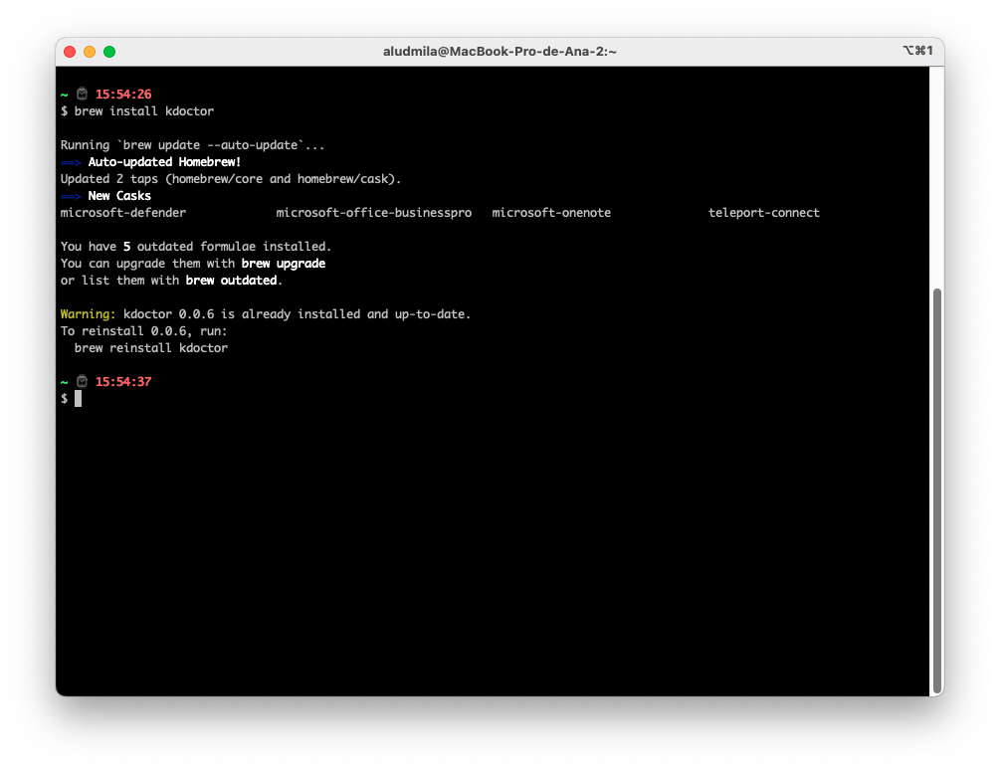
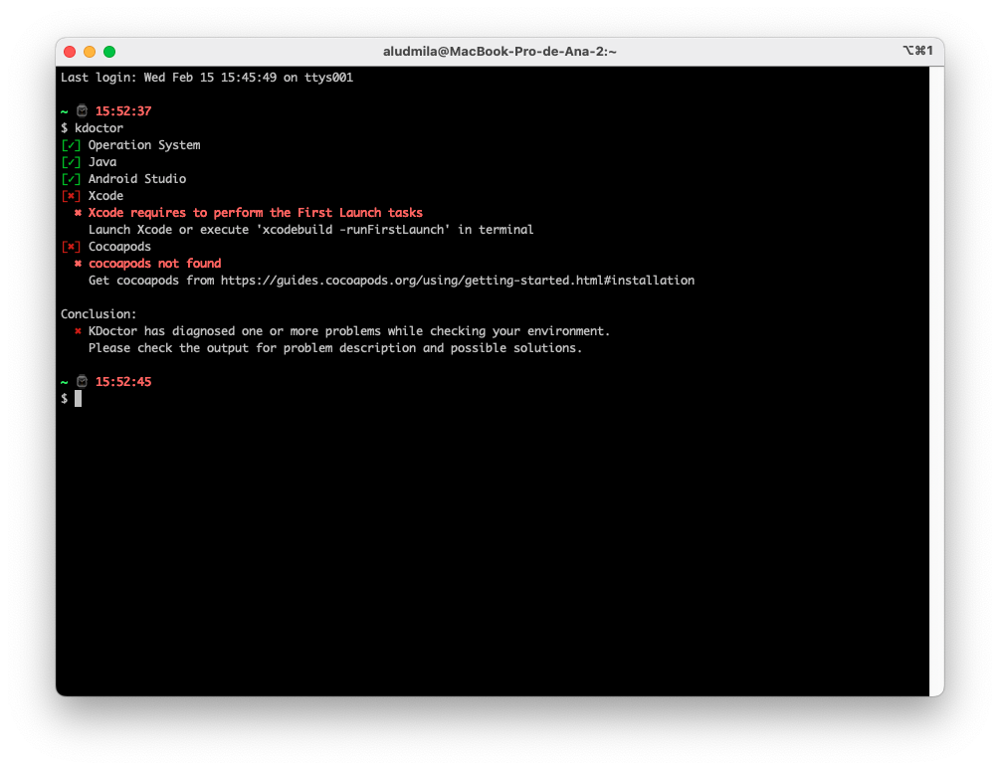
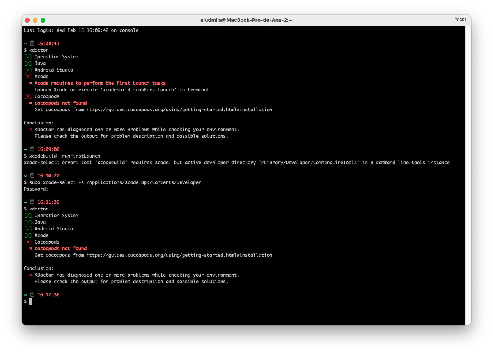
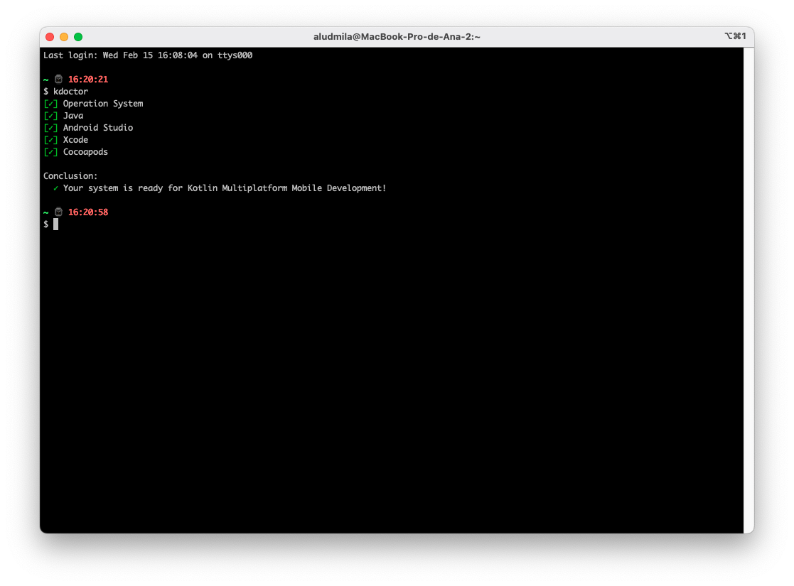

# KDoctor


O [KDoctor](https://github.com/Kotlin/kdoctor) é uma ferramenta de diagnóstico de ambientes de desenvolvimento [Kotlin Multiplataforma Mobile](https://kotlinlang.org/lp/mobile/). Seu objetivo é ajudar a detectar e solucionar problemas e atualmente funciona apenas para o sistema operacional MacOS.

**Detalhes sobre meu ambiente**
		* Processador: 2,6 GHz Intel Core i7 6-Core
		* Memória: 16 GB 2667 MHz DDR4
		* Sistema Operacional: macOS Ventura 13.2.1 (22D68)

**Lista de comandos que utilizei:**
	https://gist.github.com/knludi/da76065d04504758fa42ea139b7765cb

 **Alguns fatos relevantes sobre KDoctor:**
		* Foi desenvolvido pela JetBrains, a empresa responsável pela criação da linguagem de programação Kotlin.
		* A biblioteca pode ser usada em projetos Kotlin multiplataforma, incluindo projetos para Android, iOS e outras plataformas.
		* Pode ajudar a identificar problemas comuns em projetos Kotlin, como dependências desatualizadas, configurações incorretas do Gradle e problemas de compatibilidade entre diferentes versões de bibliotecas.
		* A biblioteca é fornecida como um plugin Gradle, o que significa que pode ser facilmente integrada em projetos Kotlin existentes.
		* O KDoctor é uma ferramenta útil para desenvolvedores Kotlin que desejam manter seus projetos atualizados e bem-mantidos. Ao identificar problemas em um estágio inicial, a biblioteca pode ajudar a evitar problemas mais graves no futuro.

**Minha experiência utilizando a ferramenta pela primeira vez**

**Configuração e instalação:** 
	Para instalar a ferramenta foi bem fácil. Para isso, executei o comando abaixo no meu terminal:

```
brew install kdoctor
```
	Após 5 minutos de espera, o KDoctor estava instalado e eu não tive nenhum problema durante este processo.

	A interface, apesar de ser via terminal, foi bem amigável e o feedback foi claro durante sua utilização.



**Utilização** 

	Para realizar o diagnóstico do meu ambiente de desenvolvimento, executei o seguinte comando no terminal:

```
kdoctor
```

	Então, obtive o seguinte resultado:




	Então segui os passos recomendados, e realizei o download e instalação do [Xcode](https://developer.apple.com/xcode/) 

	Após instalar o XCode, eu obtive um problema já conhecido, que eu resolvi executando o seguinte comando:

```
xcode-select --install
```

	Mais detalhes sobre o problema que eu experienciei pode ser encontrado neste link: 
		* [xcode - Why am I getting an “invalid active developer path” when attempting to use Git after upgrading to macOS Ventura? - Ask Different](https://apple.stackexchange.com/questions/254380/why-am-i-getting-an-invalid-active-developer-path-when-attempting-to-use-git-a)

	Neste ponto, eu infelizmente tive outro problema: Mesmo corrigindo todos os pontos sugeridos pela ferramenta, o KDoctor ainda continuou acusando inconsistências no meu ambiente: 


Depois de um tempo pesquisando, achei estes links que me trouxeram uma solução para este problema

```
sudo xcode-select -s /Applications/Xcode.app/Contents/Developer
```

Após executar este comando e tentar novamente, o problema foi em fim solucionado: 



Após a resolução dos problemas no xcode, chegou a hora de instalar o [Cocoapods](https://guides.cocoapods.org/using/getting-started.html#installation).

```
gem install cocoapods
```
E então finalmente meu ambiente está pronto!


Então eu realizei o download de um repositório de exemplo para validar meu ambiente:

**Links úteis**
* [Set up an environment | Kotlin Documentation](https://kotlinlang.org/docs/multiplatform-mobile-setup.html#check-your-environment)
* [GitHub - Kotlin/kdoctor: Environment analysis tool](https://github.com/Kotlin/kdoctor)
* [Kotlin Multiplatform for Cross-Platform Mobile Development | Kotlin Multiplatform Mobile](https://kotlinlang.org/lp/mobile/)

#gde/artigos
