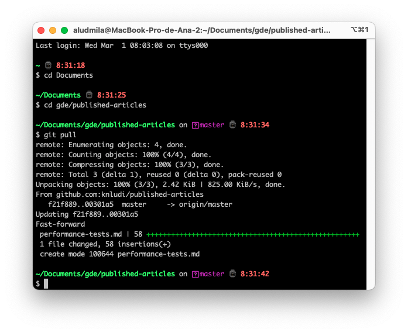

# Testes de performance em aplicações web

# Table of contents

- [Testes de performance em aplicações web](#testes-de-performance-em-aplicaes-web)
  - [Aqui estão alguns fatos relevantes sobre testes de performance em aplicações web:](#aqui-esto-alguns-fatos-relevantes-sobre-testes-de-performance-em-aplicaes-web)
  - [Links Relevantes](#links-relevantes)

Testes de performance em aplicações web são importantes para garantir que a aplicação possa lidar com uma carga de usuários simultâneos e um grande volume de dados sem perder velocidade ou falhar.

## Aqui estão alguns fatos relevantes sobre testes de performance em aplicações web:

### Testes de performance devem ser realizados em diferentes momentos do ciclo de vida da aplicação, incluindo durante o desenvolvimento, antes do lançamento e após o lançamento.

* O processo de teste de performance deve ser contínuo para garantir que a aplicação esteja sempre funcionando de forma eficiente e atendendo às necessidades dos usuários.
* O objetivo dos testes de performance é avaliar a capacidade da aplicação de lidar com uma carga de usuários e transações, identificando gargalos e pontos fracos.

### As ferramentas de teste de performance incluem JMeter, LoadRunner, Gatling, entre outras.

* [Apache JMeter: uma ferramenta de código aberto amplamente utilizada para testes de carga, stress e desempenho de aplicações web.](https://jmeter.apache.org/usermanual/get-started.html)

* [LoadRunner: uma ferramenta comercial de testes de desempenho que oferece suporte a vários protocolos, incluindo HTTP, HTTPS, FTP, SOAP e outros.](https://www.softwaretestinghelp.com/hp-loadrunner-load-testing-tool-training-tutorials/)

* [Gatling: uma ferramenta de código aberto que permite a criação de simulações de usuário e a execução de testes de carga em aplicações web.](https://gatling.io/docs/gatling/tutorials/quickstart/)

* [Selenium: uma ferramenta de automação de testes que também pode ser usada para testes de desempenho de aplicações web.](https://www.selenium.dev/documentation/test_practices/discouraged/performance_testing/)

* [Locust: uma ferramenta de código aberto que permite a simulação de milhares de usuários virtuais e a execução de testes de carga em aplicações web.](https://docs.locust.io/en/stable/quickstart.html)

* [Artillery: uma ferramenta de código aberto que oferece suporte a vários protocolos, incluindo HTTP, WebSocket e TCP, para testes de carga em aplicações web.](https://qainsights.com/getting-started-with-artillery/)

* [BlazeMeter: uma ferramenta de testes de carga baseada em nuvem que permite a execução de testes de carga em grande escala em aplicações web.](https://www.blazemeter.com/blog/jmeter-tutorial)

* [Apache Benchmark: uma ferramenta de linha de comando simples que permite a execução de testes de carga em aplicações web.](https://diamantidis.github.io/2020/07/15/load-testing-with-apache-bench)

* [K6: uma ferramenta de código aberto que permite a execução de testes de carga em aplicações web, com recursos de script e análise de desempenho.](https://k6.io/docs/)

* [WebLOAD: uma ferramenta comercial de testes de carga e desempenho de aplicações web que oferece suporte a vários protocolos.](https://www.softwaretestinghelp.com/webload-load-testing-tool-review/)

### As métricas importantes para avaliar o desempenho incluem tempo de resposta, tempo de carregamento da página, número de usuários simultâneos, taxa de erro, entre outras.
Os resultados dos testes de performance devem ser analisados para identificar áreas de melhoria e realizar ajustes no código e na infraestrutura da aplicação.

* Tempo de resposta: o tempo que leva para a aplicação responder a uma solicitação do usuário. O tempo de resposta ideal é de menos de 3 segundos.
* Tempo de carregamento da página: o tempo que leva para carregar uma página da web completamente. O tempo de carregamento ideal é de menos de 2 segundos.
* Número de usuários simultâneos: o número máximo de usuários que a aplicação pode lidar simultaneamente. Isso ajuda a identificar o limite de capacidade da aplicação.
* Taxa de erro: a proporção de solicitações de usuários que resultam em erros. A taxa de erro ideal é de menos de 1%.
* Utilização de recursos: o uso de CPU, memória, rede e outros recursos do sistema pela aplicação durante o teste de performance.
* Taxa de transferência: a quantidade de dados transferidos entre o servidor e o cliente durante o teste de performance.
* Latência: o tempo que leva para um pacote de dados viajar de um ponto a outro na rede.
* Throughput: a quantidade de solicitações por unidade de tempo que a aplicação pode lidar com sucesso.
* Tempo de resposta do banco de dados: o tempo que leva para o banco de dados responder a uma consulta.
* Tempo de resposta do servidor: o tempo que leva para o servidor responder a uma solicitação.

### As técnicas de teste de performance incluem teste de carga, teste de estresse e teste de capacidade.

* O teste de carga envolve testar a aplicação com diferentes níveis de carga de usuários para avaliar o desempenho em condições normais de uso.
* O teste de estresse envolve testar a aplicação com cargas de usuários acima do esperado para avaliar a capacidade da aplicação de lidar com picos de tráfego.
* O teste de capacidade envolve testar a aplicação com uma carga de usuários que excede sua capacidade de processamento para identificar seu limite máximo.

## Links Relevantes

### [Por que a velocidade é importante?](https://web.dev/why-speed-matters/)

### [15 BEST Performance Testing Tools (Load Testing Tools) In 2023](https://www.softwaretestinghelp.com/performance-testing-tools-load-testing-tools/)

#gde/artigos
